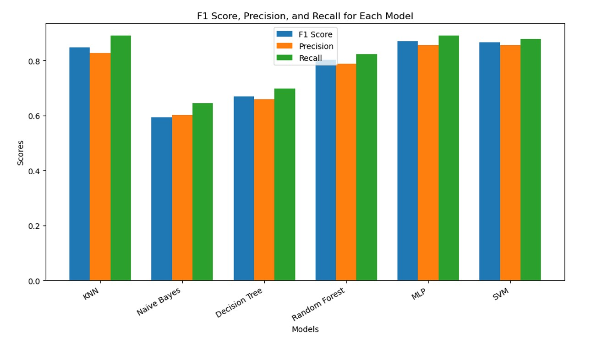
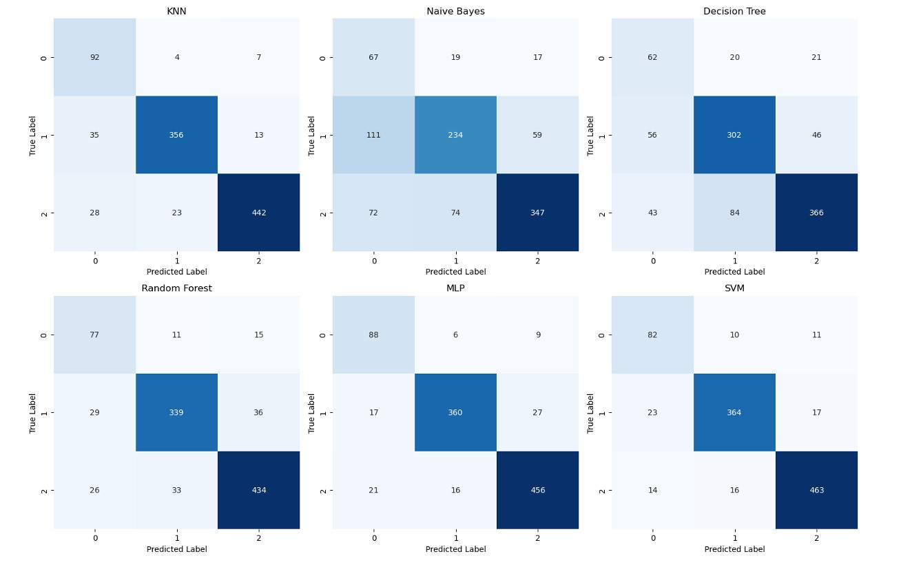
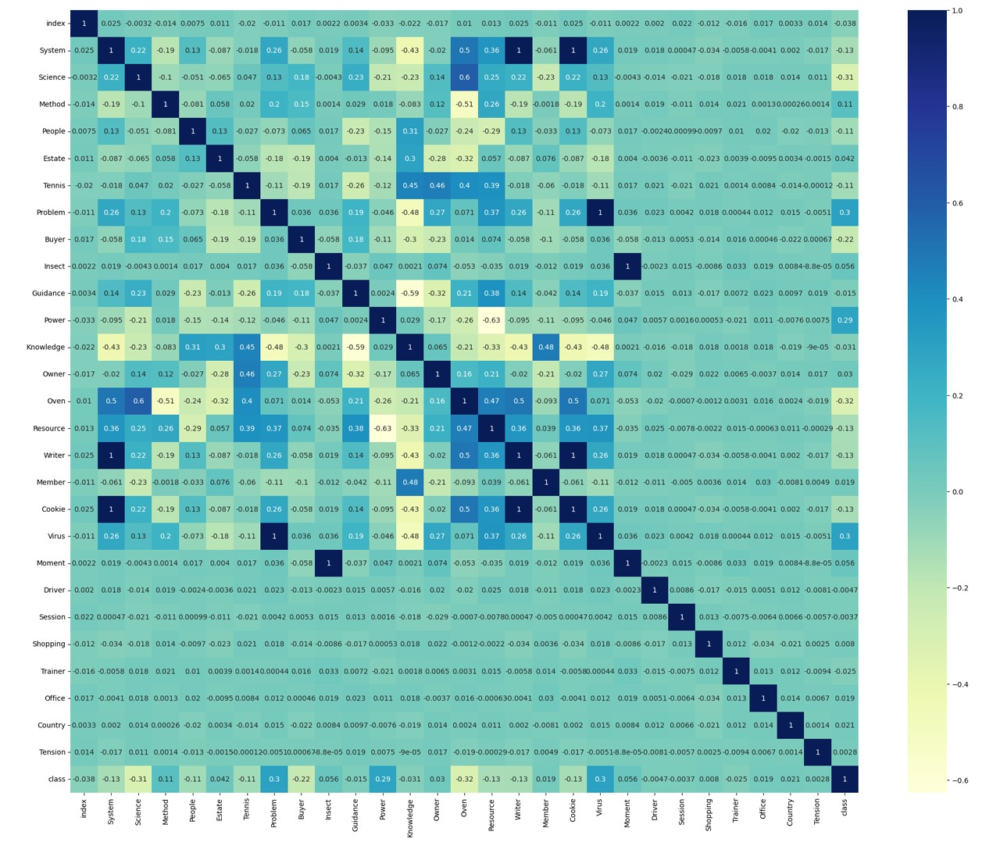

# Multi-Class Classification Project
## Technical Report

## 1.0 Summary

This machine learning project focuses on a multi-class classification task to accurately predict class labels in unseen data. The dataset consists of 5,000 entries with known class labels and 500 entries where the class labels need to be predicted. The 5,000 labeled entries are used for training and cross-validation, while the 500 unlabeled entries are treated as unseen data.

The workflow consists of two key phases: data preparation and model training/evaluation. As classifiers are only as accurate as the data used to train them, clean and structured input data is a crucial element in the training process. Various preprocessing techniques including class imbalance handling, encoding, imputation of missing values, feature selection, and normalization were employed to prepare the data.

### Key Findings and Milestones:

- **Data Exploration:** Understanding data structures, visualization of distributions, and analyzing feature relationships
- **Data Preparation:** Removing noisy columns, encoding categorical features, imputing missing values, feature scaling with normalization, and feature importance analysis
- **Classification:** Addressing class imbalance with SMOTE, feature selection using importance ranking to reduce dimensionality, hyperparameter tuning with grid search and cross-validation, and model comparison
- **Model Selection:** Comparing results of different classifiers using accuracy metrics, classification reports, confusion matrices, and ROC-AUC curves

### Critical Lessons Learned:

- The importance of structured data preprocessing for improving model performance
- Dimensionality reduction techniques are essential for removing noise and focusing on predictive features
- Visualization plays a crucial role in understanding data behaviors
- Grid search with cross-validation efficiently identifies optimal hyperparameters, though manual tweaking is still necessary
- Careful preprocessing workflow design is necessary to avoid data leakage

## 2.0 Methodology

### 2.1 Data Preparation

#### 2.1.1 Data Exploration & Preprocessing

Data preparation began with exploration to understand the data before determining necessary transformations. The 5,000 labeled entries were assigned as the training dataset, and the 500 unlabeled entries as the unseen dataset. Initial inspection revealed the number of columns and statistical information, identifying missing values, large distributions, and improper data types.

Before any operations on the training dataset, features and class labels were split into X and y variables. The data was then split into training (80%) and testing (20%) sets to prevent data leakage, which could lead to overly optimistic model performance. Transformations such as encoding, imputation, and scaling were carefully applied to avoid information leaks between the training and testing sets.

#### 2.1.1.1 Missing Values

Analysis revealed that in the training dataset:
- Tennis had 50 missing values (1%)
- Oven had 1,118 missing values (22.36%)
- Office had 3,008 missing values (60.16%)

In the unseen dataset, no missing values were found except for the class column, which was expected as it's the target for prediction.

**Addressing Missing Values:**
- The class column was dropped from the unseen dataset as expected
- The Office column was removed due to the significant amount of missing data (>60%)
- For the Oven and Tennis columns, SimpleImputer with a median-based strategy was employed, as it's more robust against skewed data and outliers compared to mean imputation

#### 2.1.1.2 Identifying and Removing Irrelevant Attributes

Irrelevant attributes that did not provide meaningful predictive value were identified and removed, including the index field and the Office column (due to excessive missing values).

#### 2.1.1.3 Duplicate Rows & Features

The dataset was scanned for duplicate entries or columns to prevent bias from over-representation. No duplicates were found, reducing the risk of skewed predictions.

#### 2.1.1.4 Data Types and Encoding

Three categorical features were identified: Music, Storage, and Guitar. To make these interpretable for machine learning models, one-hot encoding was applied, converting categorical values into binary matrices where each category becomes a separate binary feature. This increased the number of features from 29 (excluding class, index, and Office) to 44 after encoding.

#### 2.1.1.5 Data Transformation

Exploration revealed that some features had large variances based on standard deviation calculations. Feature scaling was necessary to ensure each feature contributed equally to the model's learning process.

Certain algorithms like neural networks, logistic regression, and gradient descent-based models are particularly sensitive to input data scale and may skew results without proper scaling.

**Addressing Large Data Variance:**
Standard scaling was applied using StandardScaler to normalize data to a comparable scale, preventing features with large extremes from dominating the learning process.

### 2.2 Data Classification

#### 2.2.1 Data Imbalance

The dataset showed significant class imbalance:
- Before splitting: 514 class 0, 2,021 class 1, and 2,465 class 2 instances
- After 80-20 split: 411 class 0, 1,617 class 1, and 1,972 class 2 instances in the training set

This imbalance, particularly the minority class 0, could cause poor model performance as classifiers tend to be biased toward majority classes. Initial tests without addressing this imbalance showed poor precision, recall, and F1 scores for class 0.

**Addressing Data Imbalance:**
Synthetic Minority Over-sampling Technique (SMOTE) was applied to generate synthetic data for class 0, creating a balanced dataset. After applying SMOTE, each class had 1,972 instances in the training set. This was only applied to the training set to avoid data leakage.

#### 2.2.2 Data Dimensionality

With 44 features after one-hot encoding, dimensionality reduction was necessary to improve model performance. High dimensionality can lead to "the curse of dimensionality," causing overfitting and increased complexity. Redundant features increase multicollinearity and introduce noise that can distract the model.

**Addressing Data Dimensionality:**
Random Forest Classifier was used to rank features by importance. To determine the optimal number of features, a KNN classifier was used to visualize how model performance changed with an increasing number of top-ranked features.

Analysis showed a significant improvement in test accuracy when increasing from 10 to 11 features, and another improvement when increasing to 12 features. The top 12 features provided the best balance between overfitting and underfitting, indicating good generalization.

#### 2.2.3 Model Tuning

Model tuning was performed using grid search and cross-validation to find optimal hyperparameters. Stratified K-Fold cross-validation ensured balanced class distribution across the folds. The following models were tuned:
- K-Nearest Neighbors (KNN)
- Naïve Bayes
- Decision Tree
- Random Forest
- MLP Neural Network
- Support Vector Machine (SVM)

#### 2.2.4 Validation

Validation was crucial for assessing model performance and generalization before final testing. Stratified K-Fold cross-validation was used, with 10 folds for most classifiers and 5 folds for neural networks. This technique helped balance classes during splits and identify potential overfitting issues.

#### 2.2.5 Model Comparison

Multiple metrics were used to compare model performance:
- Accuracy on training and test sets
- Confusion matrices
- Precision, recall, and F1 scores
- ROC-AUC curves

The KNN, MLP Neural Network, and SVM models showed the strongest performance, with good generalization between training and test accuracy. The KNN classifier performed particularly well at predicting the minority class. Naïve Bayes showed the poorest results with high misclassification rates across all classes.

#### 2.2.6 Model Selection

After thorough evaluation, two models were selected for final prediction:
- **KNN**: Selected for its balanced performance across all classes and strong ability to predict the minority class
- **MLP Neural Network**: Selected for its strong generalization performance and small difference between training and test accuracy

Final model accuracies:
- KNN: 89%
- MLP Neural Network: 90.4%

## 3.0 Conclusion

This project demonstrated a comprehensive approach to multi-class classification, addressing various challenges in data preprocessing and model selection. Key techniques included handling missing values, addressing class imbalance, feature selection, and hyperparameter tuning.

Six machine learning algorithms were trained and evaluated, with KNN and MLP Neural Network emerging as the top performers due to their balanced performance across all classes and strong generalization capabilities. The final models achieved test accuracies of 89% for KNN and 90.4% for Neural Network, demonstrating the effectiveness of the applied techniques.

## 4.0 Appendices

### Appendix 1: Model Performance Visualization

### Appendix 2: Confusion Matrices

### Appendix 3: Feature Importance

